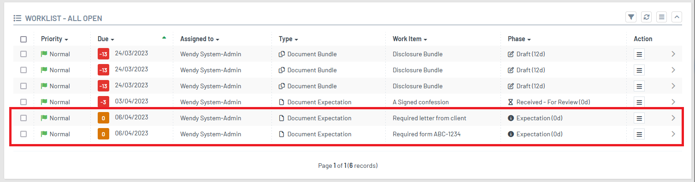
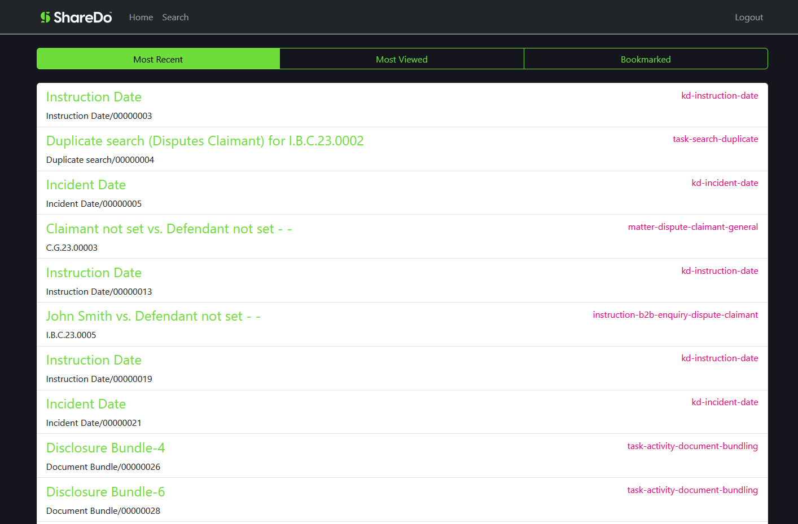
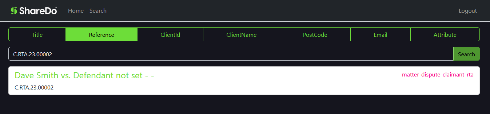
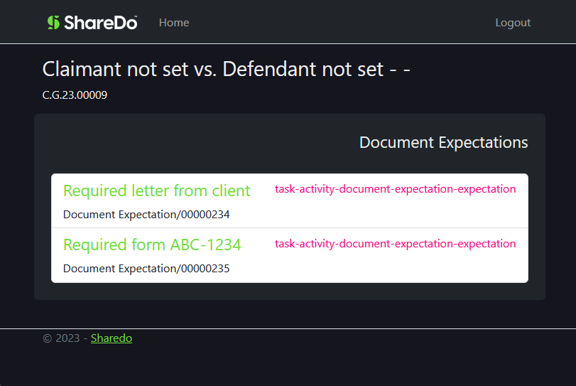
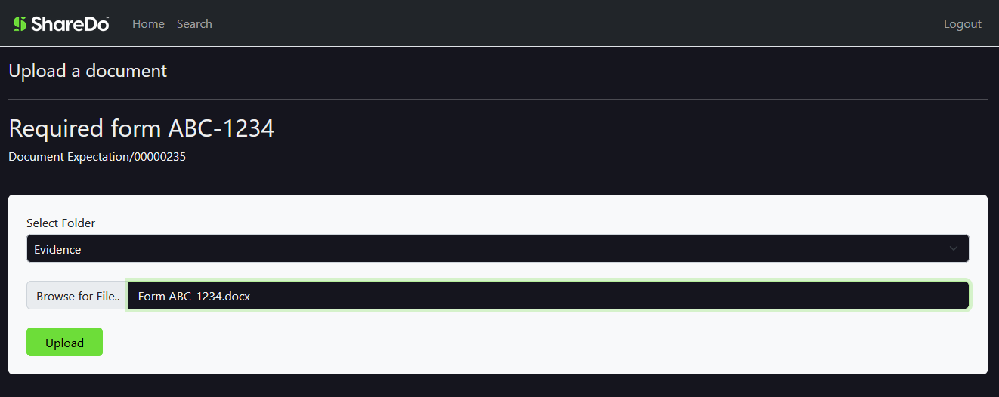
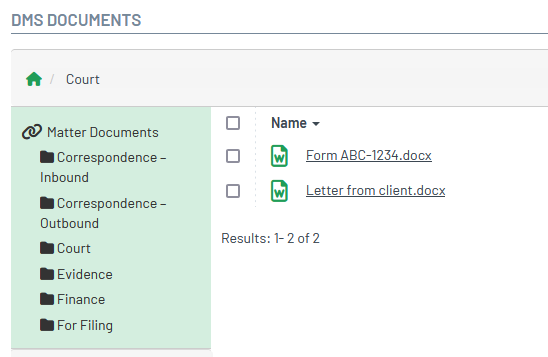
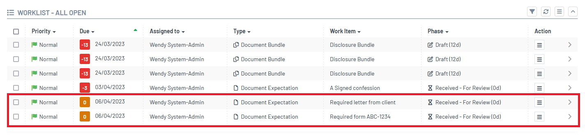

# Filing Example

This example shows how an external application may interact with a work item and it's document expectations.

* Searching "My" work items for most recent, most viewed and bookmarked.
* Retrieving folders and child folders in repository
* Uploading a file against an expectation
* Progressing the phase on the document expectation

## Connect to your Sharedo

### Configure OAuth client

In your sharedo instance, create a new OAuth client using the authorisation code flow. Set a robust secret, access tokens to 15 mins, refresh tokens to a few hours, and ensure "use reference tokens" is switched on to avoid sending full JWT tokens over the wire.

Add a reply url for the callback url.  If running locally this will be https://localhost:7093/signin-oidc.

### Configure App Settings

Go to [App Settings](./Filing.App/appsettings.json) and update "SharedoIdentity" and "SharedoApi" with the values used in OAuthClient and correct url's for your environment.

```
  "SharedoIdentity": {
    "Url": "<<SharedoIdentityUrl>>",
    "ClientId": "<<OAuth Client Id>>",
    "ClientSecret": "<<OAuth Client Secret>>"
  },
  "SharedoApi": {
    "Url": "<<Sharedo Url>>"
  }
```

## Required Global Features

The application will throw an exception if some features are disabled in your sharedo instance.

* **Bookmarks** - If disabled the request to **/api/v1/public/my/workitems/bookmarked/{count}** will return a 400 (BadRequest).

* **Page View Analytics** - if disabled the request to **/api/v1/public/my/workitems/most-recent/{count}** and **/api/v1/public/my/workitems/most-viewed/{count}** will return a 400 (BadRequest).

## Walkthrough

### Setup Document Expectations

In Sharedo, create a work item and then add some document expectations so that the expectations are in a phase ready to receive documents



### Login Page

Run the application, it will start on a login page.  Clicking login will attempt to login using the above client settings.


If the OAuth client is configured correctly Sharedo will prompt you to allow access the client,  once logged in the application will take you to the home page.

### Home Page

The home page shows work items, with options to view by most recent, most viewed or bookmarked.



### Search Page

The search page can search for matters using the different types of searches displayed.



Clicking a work item will take you to the document expectations page.  Using either the home page or search page, find the work item you added the document expectations to.

### Document Expectations Page

This page shows any descendent document expectations for the work item that are in a current phase **"task-activity-document-expectation-expectation"**.



If setup correctly you should see the expectations you added in sharedo for the work item.
Select an expectation to proceed to upload page.

### Document Upload Page

To upload file, select the destination folder in the work items default repository, and then browse for the file.



Click upload will upload file into the default repository for work item, and progress the document expectation to next phase.

Got to the work item in Sharedo and verify any documents have been added the correct folder.


And the worklist is showing updated phase for the affected expectations.
